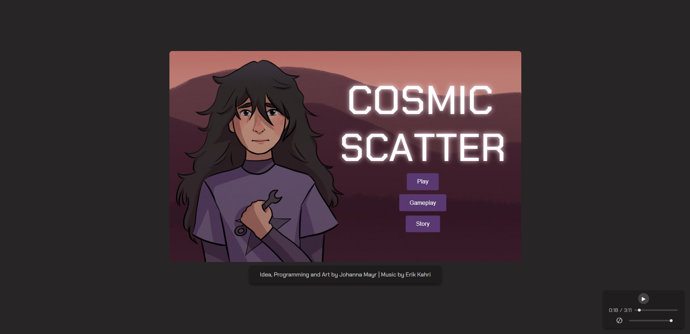
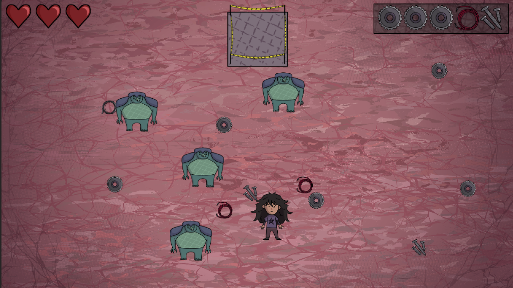
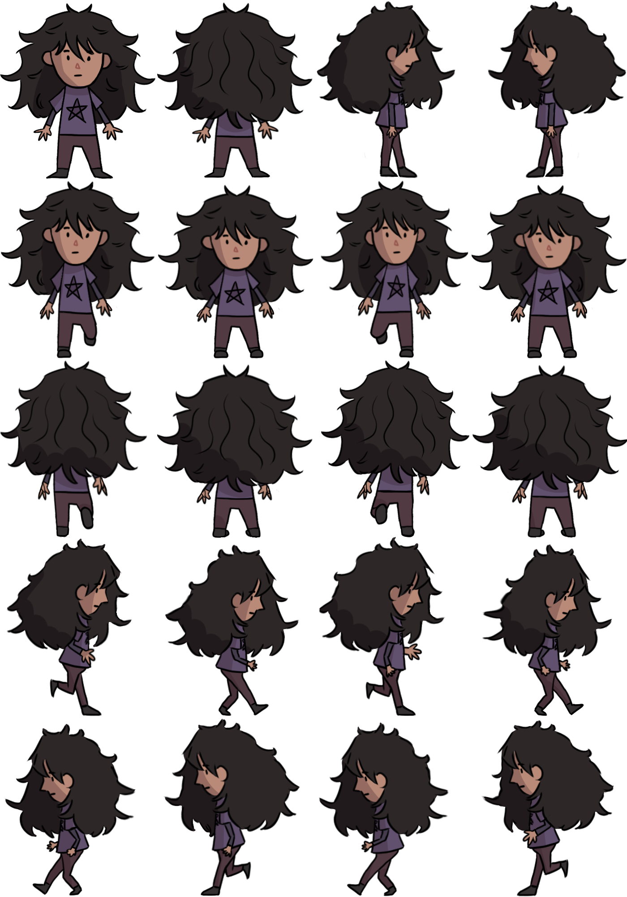
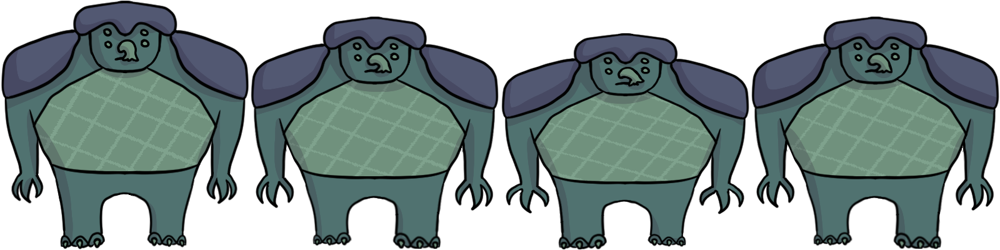
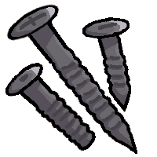
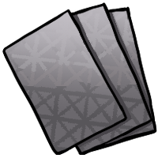
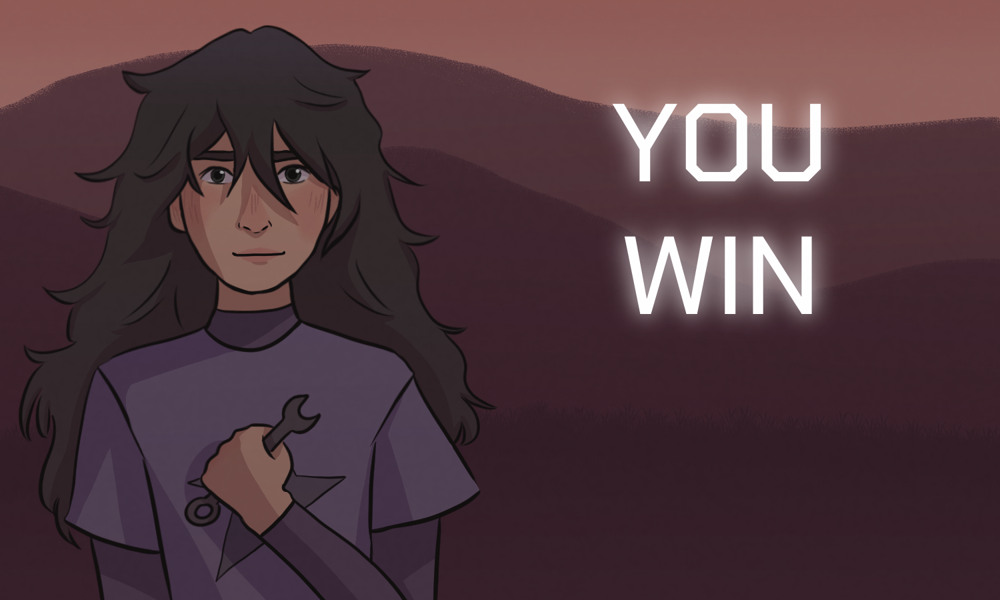
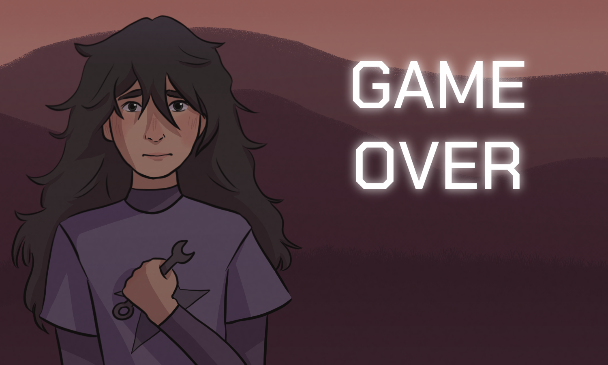
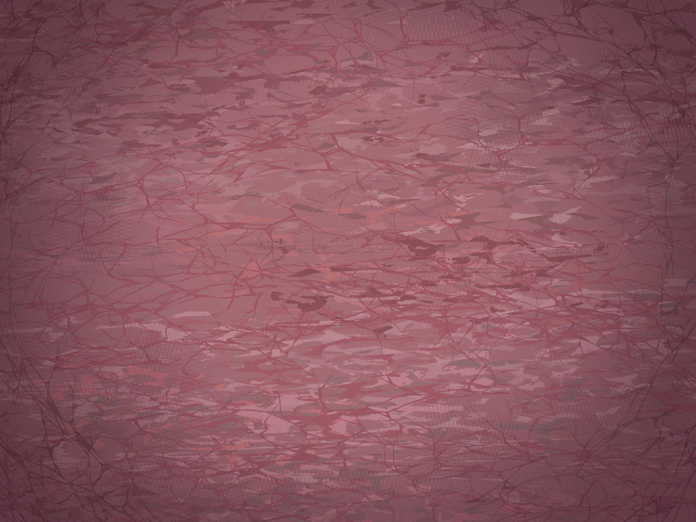

# ⭐Cosmic Scatter⭐
CCL1 by Johanna Mayr

## Introduction
**Cosmic Scatter** is a top-down action adventure, in which you have to evade enemies and collect materials in the correct order.

### Screenshot

  
  
🔼 Screenshot of the Game in Browser.

### Main Gameplay

  
  
🔼 What the main gameplay looks like.

### Music
The song for the background music was made by Erik Kahri, a friend of mine, who likes composing in his free time. In order to do it justice, I included an audio player, where you can start and pause the music, adjust the volume, and mute the music.

  

### 🎮**Play the Game**🎮
[Click here to play the game⭐](https://einfrog.github.io/CCL1/)

Since the Display Screens are Images that are loaded, it may take longer for them to load when using GITHUB Pages then it would when hosting the website locally.

## Gameplay and Mechanics
In every playthrough, a random recipe of scraps is provided for you. Collect them and carry them to the spaceship construction site. If you install them in the correct order, you can complete the spaceship build and escape the planet. 

Be careful! Don’t let the scrapyard guards catch you. If they get a hold of you three times, they’re going to execute you.

Use WASD to go up to scraps you want to pick up and press J to take them with you. If you want to drop them back down, press J again.

Once you’ve brought a desired scrap to the spaceship construction site, press L to install it. If you’ve mistakenly installed a wrong scrap, press L again to extract it from the construction.

## Story
In a distant galaxy torn apart by war, planets are falling to invading alien forces, leaving destruction and despair in their wake. During one such invasion, a young girl named Rory is separated from her parents as her home planet is conquered.

Deemed useless by the invaders because of her age, Rory is abandoned on a barren scrap planet. But Rory isn’t just any child. She’s resourceful and clever. Her father, a skilled mechanic, taught her how to tinker and build from a young age. Now, armed with her knowledge and determination, Rory must find a way to use the planet’s discarded remnants to construct a spaceship and escape her grim fate.

## Art
All art assets were done by me using Clip Studio Paint and a drawing tablet. The process was a lot of fun. I usually started with very primitive sprites and images to test my code and figure out what sizes I should choose for all the elements. Then, after every step in the drawing process (which were sketching, lineart, coloring and shading), I checked the sprites again to see how my design and color choices harmonized with the game design that was already in place. That way I could repeatedly check my color and design choices and iteratively adjust to achieve the desired aesthetic.

### Rory

  
  
🔼 The Spritesheet for Rory, the main character.

### Enemy

  
  
🔼 The Spritesheet for the enemies, which are alien scrapyard guards.

### Scraps

  
  
  
  
  
    
🔼 The Sprites for the five different types of scraps.

### Display Screens

  
  
🔼 The Start Screen design.

  
  
🔼 The "Game Won" Screen design.

  
  
🔼 The "Game Over" Screen design.

### Background

  
  
🔼 The underlying background image.

## Reflection

### What went well
- **Problem-Solving**: I managed to fix every error I encountered, either with the help of lecturers or tutors, my colleagues, friends, Stack Overflow, or the use of AI. I'm pleasantly to surprised at how little I had to use AI, as I usually understood errors on my own, when I explained my code to colleagues and wondered why it wasn't working, which basically means I did a lot of rubber duck debugging. 
- **Art Process**: The drawing process went really well. I had a lot of fun designing and taking a break from coding while drawing. At the beginning I was worried I would be too slow to finish all art assets in time, but I managed to finish everything in time.
### Challenges
- **Game Design**: While coding, I repeatedly came to the conslusion that my game is not as interesting or as fun to play as the games of my peers. I considered different approaches, for example a maze, or obstacles. I tested both approaches and came to the conclusion that that was even less fun. So in the end I decided on increasing the number of enemies.
- **Endurance and Optimism**: From time to time I momentarily lost hope in both my game idea and my coding skills, when I compared it to the games of my colleagues. I definitely spent some time moping, but ultimately I took my doubts as motivation to put in some extra hours of drawing and debugging, so I could have an outcome that I can be proud of.

### Lessons Learned
- **Planning and Prototyping**: The issue, that my game design lacks a bit of fun factor, could have been avoided if I spent some more time in the planning and prototyping phase. From the very first day I was very set on this idea of the recipe, collecting, and avoiding enemies, but if I had spent some more time brainstorming before starting to code, I might have come up with something more interesting. The reason why I rushed a bit into the implementation was the set time limit, I wanted to get coding as quickly as possible. Next time I will try to find a better balance.
